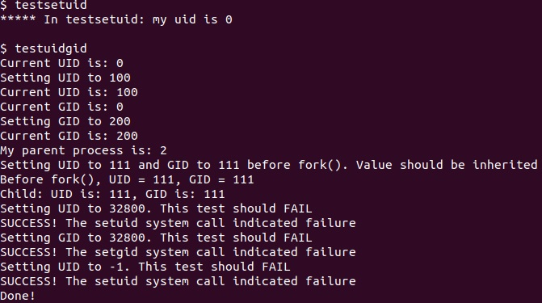
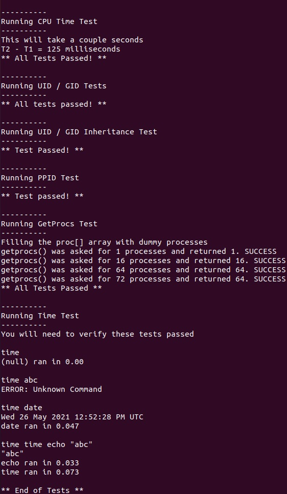
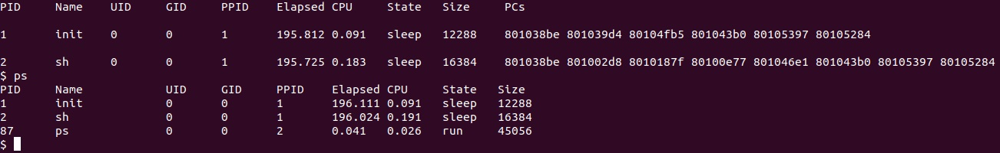

# Test-run Image

## UID test


## Time Test


## CTRL + p and ps


# Code Changes

## makefile

```diff
-CS333_PROJECT ?= 1
+CS333_PROJECT ?= 2
PRINT_SYSCALLS ?= 0
CS333_CFLAGS ?= -DPDX_XV6
```

## user.h

added in line 32
```c
#ifdef CS333_P2
uint getuid(void);
uint getgid(void);
uint getppid(void);

int setuid(uint);
int setgid(uint);
int getprocs(uint max, struct uproc* table);
#endif 
```

## usys.S

added in line 34
```c
SYSCALL(getuid)
SYSCALL(getgid)
SYSCALL(getppid)
SYSCALL(setuid)
SYSCALL(setgid)
SYSCALL(getprocs)
```

## syscall.h

added in line 25
```c
#define SYS_getuid      SYS_date+1
#define SYS_getgid      SYS_getuid+1
#define SYS_getppid     SYS_getgid+1
#define SYS_setuid      SYS_getppid+1
#define SYS_setgid      SYS_setuid+1
#define SYS_getprocs    SYS_setgid+1
```

## syscall.c

added in line 10
```c
#ifdef CS333_P2
extern int sys_getuid(void);
extern int sys_getgid(void);
extern int sys_getppid(void);
extern int sys_setuid(void);
extern int sys_setgid(void);
extern int sys_getprocs(void);
#endif
```

added in line 150
```c
#ifdef CS333_P2
[SYS_getuid]    sys_getuid,
[SYS_getgid]    sys_getgid,
[SYS_getppid]   sys_getppid,
[SYS_setuid]    sys_setuid,
[SYS_setgid]    sys_setgid,
[SYS_getprocs]  sys_getprocs,
#endif
```

## sysproc.c

added in line 12
```c
#ifdef CS333_P2
  #include "uproc.h"
#endif  // CS333_P2
```

added in line 116
```c
#ifdef CS333_P2
int
sys_getuid(void)
{
  struct proc *curproc = myproc();
  return curproc->uid;
}

int
sys_getgid(void)
{
  struct proc *curproc = myproc();
  return curproc->gid;
}

int
sys_getppid(void)
{
  struct proc *curproc = myproc();
  struct proc *parent = curproc->parent;
  return parent != NULL ? parent->pid : 0;
}

int sys_setuid(void)
{
  uint uid;
  struct proc *curproc = myproc();

  if(argint(0, (int*)&uid) >= 0) {
    if(uid >= 0 && uid <= 32767) {
      curproc->uid = uid;
      return 0;
    }
  }

  return -1;
}

int sys_setgid(void)
{
  uint gid;
  struct proc *curproc = myproc();

  if(argint(0, (int*)&gid) >= 0) {
    if(gid >= 0 && gid <= 32767) {
      curproc->gid = gid;
      return 0;
    }
  }

  return -1;
}

int sys_getprocs(void)
{
  uint max;
  struct uproc* proc;

  if (argint(0,(int*)&max) >= 0) {
    if (max == 1 || max == 16 || max == 64 || max == 72) {
      if (argptr(1, (void*)&proc, sizeof(struct uproc)) >= 0) {
        return getprocs(max, proc);
      }
    }
  }

  return -1;
}
#endif //CS333_P2
```

## defs.h

added in line 131
```c
#ifdef CS333_P2
  int getprocs(uint max, struct uproc* upTable);
#endif
```

## proc.c

added in line 10
```c
#ifdef CS333_P2
  #include "uproc.h"
#endif
```

added in line 160
```c
  #ifdef CS333_P2
    p->cpu_ticks_total = 0;
    p->cpu_ticks_in = 0;
  #endif
```

added in line 194
```c
  #ifdef CS333_P2
    p->uid = DEFAULT_UID;
    p->gid = DEFAULT_GID;
  #endif
```

added in line 255
```c
  #ifdef CS333_P2
    np->uid = curproc->uid;
    np->gid = curproc->gid;
  #endif
```

added in line 413
```c
  #ifdef CS333_P2
    p->cpu_ticks_in = ticks;
  #endif
```

added in line 456
```c
  #ifdef CS333_P2
    p->cpu_ticks_total += (ticks - p->cpu_ticks_in);
  #endif
```

in line 586
```diff
  -cprintf("TODO for Project 2, delete this line and implement procdumpP2P3P4() in proc.c to print a row\n");
  -return;
```
changed into
```c
  uint elapsed = ticks-p->start_ticks;
  uint elapsedLeft = (elapsed) / 1000;
  uint elapsedRight = elapsed % 1000;
  char *zeros = "";
  char *cpuZeros = "";
  uint cpuTicksTotal = p->cpu_ticks_total;
  uint cpuSecond = cpuTicksTotal / 1000;
  uint cpuMs = cpuTicksTotal % 1000;
  uint ppid = p->parent ? p->parent->pid : p->pid;

  if (elapsedRight < 10) {
    zeros = "00";
  } else if (elapsedRight < 100) {
    zeros = "0";
  }

  if (cpuMs < 10) {
    cpuZeros = "00";
  } else if (cpuMs < 100) {
    cpuZeros = "0";
  }

  cprintf(
    "\n%d\t%s\t%d\t%d\t%d\t%d.%s%d\t%d.%s%d\t%s\t%d\t", 
    p->pid, 
    p->name, 
    p->uid, 
    p->gid, 
    ppid, 
    elapsedLeft, 
    zeros, 
    elapsedRight, 
    cpuSecond,
    cpuZeros,
    cpuMs,
    state_string, 
    p->sz
  );
```

added in line 982
```c
#ifdef CS333_P2
int
getprocs(uint max, struct uproc* upTable){
  struct proc* p;
  int procsNumber = 0;
  acquire(&ptable.lock);

  for(p = ptable.proc; p < &ptable.proc[NPROC]; p++){
    if (procsNumber < max) {
      if(p->state != UNUSED && p->state != EMBRYO) {
        if(p->state >= 0 && p->state < NELEM(states) && states[p->state]){
          safestrcpy(upTable[procsNumber].state, states[p->state],STRMAX);
        } else {
          safestrcpy(upTable[procsNumber].state,"???",STRMAX);
        }

        upTable[procsNumber].pid = p->pid;
        upTable[procsNumber].uid = p->uid;
        upTable[procsNumber].gid = p->gid;
        upTable[procsNumber].ppid = p->parent ? p->parent->pid : p->pid;
        upTable[procsNumber].elapsed_ticks = ticks - p->start_ticks;
        upTable[procsNumber].CPU_total_ticks = p->cpu_ticks_total;
        upTable[procsNumber].size = p->sz;
        safestrcpy(upTable[procsNumber].name, p->name, STRMAX);
        procsNumber++;
      }
    } else {
      break;
    }
  }
  release(&ptable.lock);
  return procsNumber;
}
#endif // CS333_P2
```

## proc.h

added in line 53
```c
  #ifdef CS333_P2
    uint uid;
    uint gid;
    uint cpu_ticks_total;
    uint cpu_ticks_in;
  #endif
```

## uproc.h

in first line added
```c
#ifdef CS333_P2
  #include "types.h"
```
and last line
```c
endif
```

# added code

## testsetuid.c

```c
#ifdef CS333_P2
#include "types.h"
#include "user.h"

int
main(int argc, char *argv[])
{
  printf(1, "***** In %s: my uid is %d\n\n", argv[0], getuid());
  exit();
}
#endif
```

## time.c

```c
#ifdef CS333_P2
#include "types.h"
#include "user.h"

int main(int argc, char *argv[]) {
  if(argc == 1) {
    printf(1, "(null) ran in 0.00\n");
  } else {
    int start = uptime();
    int pid = fork();

    if (pid > 0) {
      pid = wait();
    } else if (pid == 0) {
      exec(argv[1], argv+1);
      printf(1, "ERROR: Unknown Command\n");
      kill(getppid());
      exit();
    } else {
      printf(1, "ERROR: Fork error return -1\n");
    }

    int end = uptime();
    int timelapse = end - start;
    int seconds = timelapse/1000;
    int ms = timelapse%1000;
    char *msZeros = "";

    if (ms < 10) {
      msZeros = "00";
    } else if (ms < 100) {
      msZeros = "0";
    }

    printf(
      1,
      "%s ran in %d.%s%d\n",
      argv[1],
      seconds,
      msZeros,
      ms
    );
  }

  exit();
}
#endif
```

## ps.c

```c
#ifdef CS333_P2
#include "types.h"
#include "user.h"
#include "uproc.h"

#define MAX 16

int
main(void)
{
  struct uproc *proc = malloc(sizeof(struct uproc)*MAX);
  int procsNumber = getprocs(MAX, proc);
  printf(1,"PID\tName\t\tUID\tGID\tPPID\tElapsed\tCPU\tState\tSize\n");

  int i;
  for(i = 0; i<procsNumber; i++){
    struct uproc currentProc = proc[i];
    uint elapsedTicks = currentProc.elapsed_ticks;
    uint elapsedTicksSecond = elapsedTicks/1000;
    uint elapsedTicksMs = elapsedTicks%1000;
    char* zeros = "";
    uint cpuTotalTicks = currentProc.CPU_total_ticks;
    uint cpuTotalTicksSecond = cpuTotalTicks/1000;
    uint cpuTotalTicksMs = cpuTotalTicks % 1000;
    char* cpuZeros = "";

    if (elapsedTicksMs < 10) {
      zeros = "00";
    } else if (elapsedTicksMs < 100) {
      zeros = "0";
    }

    if(cpuTotalTicksMs < 10){
      cpuZeros = "00";
    } else if (cpuTotalTicksMs < 100) {
      cpuZeros = "0";
    }

    printf(
      1,
      "%d\t%s\t\t%d\t%d\t%d\t%d.%s%d\t%d.%s%d\t%s\t%d\n",
      currentProc.pid,
      currentProc.name,
      currentProc.uid,
      currentProc.gid,
      currentProc.ppid,
      elapsedTicksSecond,
      zeros,
      elapsedTicksMs,
      cpuTotalTicksSecond,
      cpuZeros,
      cpuTotalTicksMs,
      currentProc.state,
      currentProc.size
    );
  }

  free(proc);
  exit();
}
#endif
```


