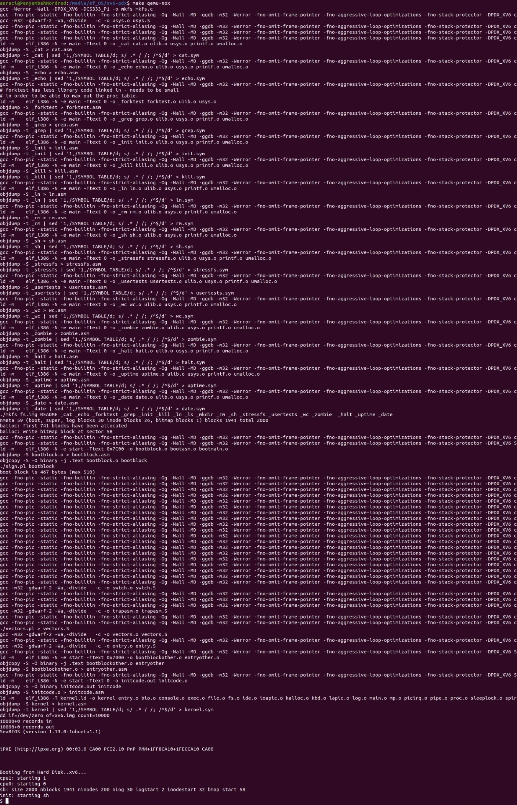
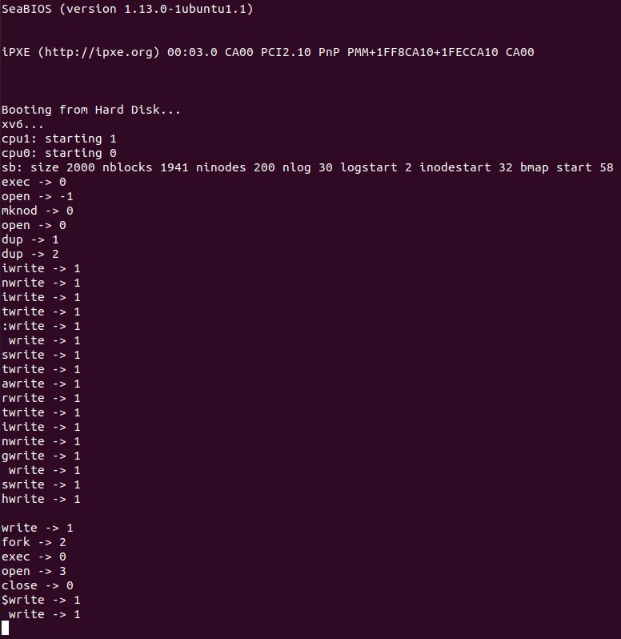
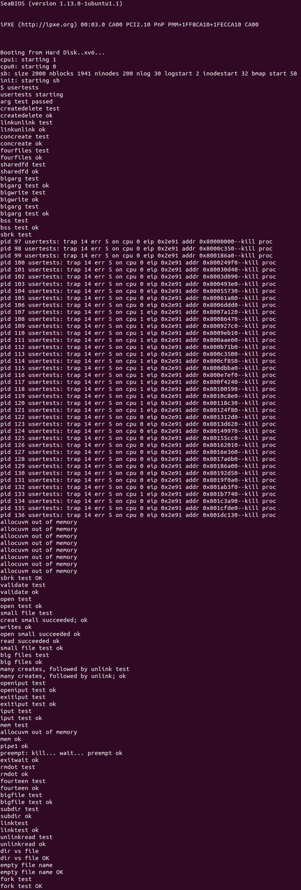
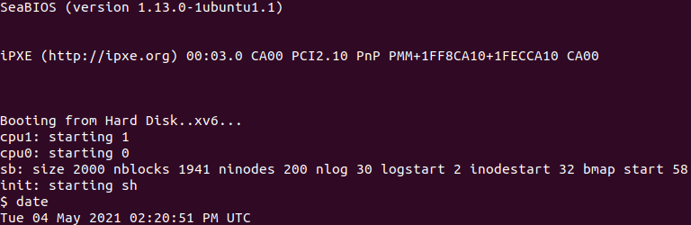
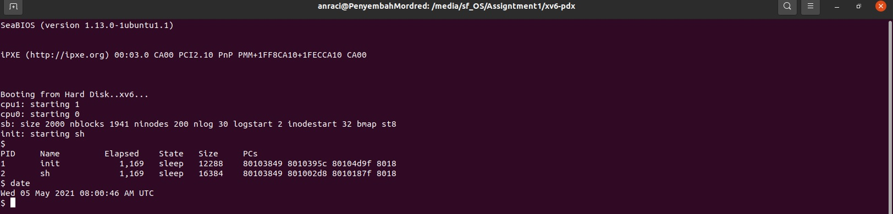

# Compilation Test

## Image


## Makefile

```diff
-CS333_PROJECT ?= 0
+CS333_PROJECT ?= 1
PRINT_SYSCALLS ?= 0
CS333_CFLAGS ?= -DPDX_XV6
```


# System Call Tracing

## Image


## syscall.c

```diff
if(num > 0 && num < NELEM(syscalls) && syscalls[num]) {
    curproc->tf->eax = syscalls[num]();
+   #ifdef PRINT_SYSCALLS
+     cprintf("%s -> %d \n", syscallnames[num], curproc->tf->eax);
+   #endif
```

## Makefile
```diff
CS333_PROJECT ?= 1
-PRINT_SYSCALLS ?= 0
+PRINT_SYSCALLS ?= 1
CS333_CFLAGS ?= -DPDX_XV6
```

# Conditional Compilation

## First Condition
```c
+CS333_PROJECT ?= 0
PRINT_SYSCALLS ?= 0
CS333_CFLAGS ?= -DPDX_XV6
```


## Second Condition
```c
+CS333_PROJECT ?= 1
PRINT_SYSCALLS ?= 0
CS333_CFLAGS ?= -DPDX_XV6
```


# Date System Call

## Image


## Makefile
```diff
ifeq ($(CS333_PROJECT), 1)
CS333_CFLAGS += -DCS333_P1
-CS333_UPROGS += #_date
+CS333_UPROGS += _date
endif
```

## user.h

```diff
// system calls
int fork(void);
int exit(void) __attribute__((noreturn));
int wait(void);
int pipe(int*);
int write(int, void*, int);
int read(int, void*, int);
int close(int);
int kill(int);
int exec(char*, char**);
int open(char*, int);
int mknod(char*, short, short);
int unlink(char*);
int fstat(int fd, struct stat*);
int link(char*, char*);
int mkdir(char*);
int chdir(char*);
int dup(int);
int getpid(void);
char* sbrk(int);
int sleep(int);
int uptime(void);
int halt(void);
+#ifdef CS333_P1
+int date(struct rtcdate*);
+#endif // CS333_P1
```

## usys.S
```diff
SYSCALL(fork)
SYSCALL(exit)
SYSCALL(wait)
SYSCALL(pipe)
SYSCALL(read)
SYSCALL(write)
SYSCALL(close)
SYSCALL(kill)
SYSCALL(exec)
SYSCALL(open)
SYSCALL(mknod)
SYSCALL(unlink)
SYSCALL(fstat)
SYSCALL(link)
SYSCALL(mkdir)
SYSCALL(chdir)
SYSCALL(dup)
SYSCALL(getpid)
SYSCALL(sbrk)
SYSCALL(sleep)
SYSCALL(uptime)
SYSCALL(halt)
+SYSCALL(date)
```

## syscall.h
```diff
#define SYS_fork    1
#define SYS_exit    SYS_fork+1
#define SYS_wait    SYS_exit+1
#define SYS_pipe    SYS_wait+1
#define SYS_read    SYS_pipe+1
#define SYS_kill    SYS_read+1
#define SYS_exec    SYS_kill+1
#define SYS_fstat   SYS_exec+1
#define SYS_chdir   SYS_fstat+1
#define SYS_dup     SYS_chdir+1
#define SYS_getpid  SYS_dup+1
#define SYS_sbrk    SYS_getpid+1
#define SYS_sleep   SYS_sbrk+1
#define SYS_uptime  SYS_sleep+1
#define SYS_open    SYS_uptime+1
#define SYS_write   SYS_open+1
#define SYS_mknod   SYS_write+1
#define SYS_unlink  SYS_mknod+1
#define SYS_link    SYS_unlink+1
#define SYS_mkdir   SYS_link+1
#define SYS_close   SYS_mkdir+1
#define SYS_halt    SYS_close+1
+#define SYS_date    SYS_halt+1
```

## syscall.c

```diff
static int (*syscalls[])(void) = {
[SYS_fork]    sys_fork,
[SYS_exit]    sys_exit,
[SYS_wait]    sys_wait,
[SYS_pipe]    sys_pipe,
[SYS_read]    sys_read,
[SYS_kill]    sys_kill,
[SYS_exec]    sys_exec,
[SYS_fstat]   sys_fstat,
[SYS_chdir]   sys_chdir,
[SYS_dup]     sys_dup,
[SYS_getpid]  sys_getpid,
[SYS_sbrk]    sys_sbrk,
[SYS_sleep]   sys_sleep,
[SYS_uptime]  sys_uptime,
[SYS_open]    sys_open,
[SYS_write]   sys_write,
[SYS_mknod]   sys_mknod,
[SYS_unlink]  sys_unlink,
[SYS_link]    sys_link,
[SYS_mkdir]   sys_mkdir,
[SYS_close]   sys_close,
#ifdef PDX_XV6
[SYS_halt]    sys_halt,
#endif // PDX_XV6
+#ifdef CS333_P1
+[SYS_date]    sys_date,
+#endif
```


```diff
#ifdef PRINT_SYSCALLS
static char *syscallnames[] = {
  [SYS_fork]    "fork",
  [SYS_exit]    "exit",
  [SYS_wait]    "wait",
  [SYS_pipe]    "pipe",
  [SYS_read]    "read",
  [SYS_kill]    "kill",
  [SYS_exec]    "exec",
  [SYS_fstat]   "fstat",
  [SYS_chdir]   "chdir",
  [SYS_dup]     "dup",
  [SYS_getpid]  "getpid",
  [SYS_sbrk]    "sbrk",
  [SYS_sleep]   "sleep",
  [SYS_uptime]  "uptime",
  [SYS_open]    "open",
  [SYS_write]   "write",
  [SYS_mknod]   "mknod",
  [SYS_unlink]  "unlink",
  [SYS_link]    "link",
  [SYS_mkdir]   "mkdir",
  [SYS_close]   "close",
#ifdef PDX_XV6
  [SYS_halt]    "halt",
#endif // PDX_XV6
+#ifdef CS333_P1
+  [SYS_date]    "date",
+#endif
};
#endif // PRINT_SYSCALLS
```

## sysproc.c
```c
int
sys_date(void)
{
  struct rtcdate *d;
  if(argptr(0, (void*)&d, sizeof(struct rtcdate)) <0)
    return -1;
  else{
    cmostime(d);
    return 0;
  }
}
```
added entirely in sysproc.c

# Process Information

## Image


## proc.c

```diff
#elif defined(CS333_P1)
void
procdumpP1(struct proc *p, char *state_string)
{
+  int sekarang = ticks - (p -> start_ticks);
+  cprintf("%d\t%s\t\t%d,%d\t%s\t%d\t", p->pid, p->name, sekarang/1000 , sekarang%1000, states[p->state], p->sz);
  return;
}
#endif
```

## proc.h
```diff
struct proc {
  uint sz;                     // Size of process memory (bytes)
  pde_t* pgdir;                // Page table
  char *kstack;                // Bottom of kernel stack for this process
  enum procstate state;        // Process state
  uint pid;                    // Process ID
  struct proc *parent;         // Parent process. NULL indicates no parent
  struct trapframe *tf;        // Trap frame for current syscall
  struct context *context;     // swtch() here to run process
  void *chan;                  // If non-zero, sleeping on chan
  int killed;                  // If non-zero, have been killed
  struct file *ofile[NOFILE];  // Open files
  struct inode *cwd;           // Current directory
  char name[16];               // Process name (debugging)
+ uint start_ticks;
};
```