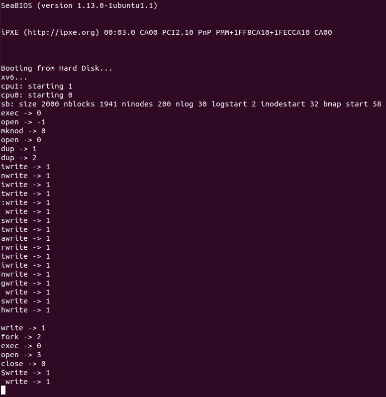

# Compilation Test

## Image


## Makefile
```c
CS333_PROJECT ?= 0
PRINT_SYSCALLS ?= 0
CS333_CFLAGS ?= -DPDX_XV6
```
changed into
```
CS333_PROJECT ?= 1
PRINT_SYSCALLS ?= 0
CS333_CFLAGS ?= -DPDX_XV6
```

# System Call Tracing

## Image


## syscall.c
```
if(num > 0 && num < NELEM(syscalls) && syscalls[num]) {
    curproc->tf->eax = syscalls[num]();
```
ditambahkan
```
if(num > 0 && num < NELEM(syscalls) && syscalls[num]) {
    curproc->tf->eax = syscalls[num]();
    #ifdef PRINT_SYSCALLS
      cprintf("%s -> %d \n", syscallnames[num], curproc->tf->eax);
    #endif
```

## Makefile
```
CS333_PROJECT ?= 1
PRINT_SYSCALLS ?= 0
CS333_CFLAGS ?= -DPDX_XV6
```
changed into
```
CS333_PROJECT ?= 1
PRINT_SYSCALLS ?= 1
CS333_CFLAGS ?= -DPDX_XV6
```

# Conditional Compilation

## First Condition
```
CS333_PROJECT ?= 0
PRINT_SYSCALLS ?= 0
CS333_CFLAGS ?= -DPDX_XV6
```


## Second Condition
```
CS333_PROJECT ?= 1
PRINT_SYSCALLS ?= 0
CS333_CFLAGS ?= -DPDX_XV6
```


# Date System Call

## Image


## Makefile
```
ifeq ($(CS333_PROJECT), 1)
CS333_CFLAGS += -DCS333_P1
CS333_UPROGS += #_date
endif
```
removed #
```
ifeq ($(CS333_PROJECT), 1)
CS333_CFLAGS += -DCS333_P1
CS333_UPROGS += _date
endif
```

## user.h
```
#ifdef CS333_P1
int date(struct rtcdate*);
#endif // CS333_P1
```
added bellow
```
int halt(void;
```

## usys.S
```
SYSCALL(date)
```
added bellow
```
SYSCALL(halt)
```

## syscall.h
```
#define SYS_date	SYS_halt+1
```
added bellow
```
#define SYS_halt	SYS_close+1
```

## syscall.c
```
#ifdef CS333_P1
extern int sys_date(void);
#endif
```
added in extern section


```
#ifdef CS333_P1
[SYS_date]	sys_date,
#endif
```
added on
```
static int (*syscall[])(void)
```


```
#ifdef CS33_P1
[SYS_date]	"date",
#endif
```
added in
```
static char *syscallnames[]
```